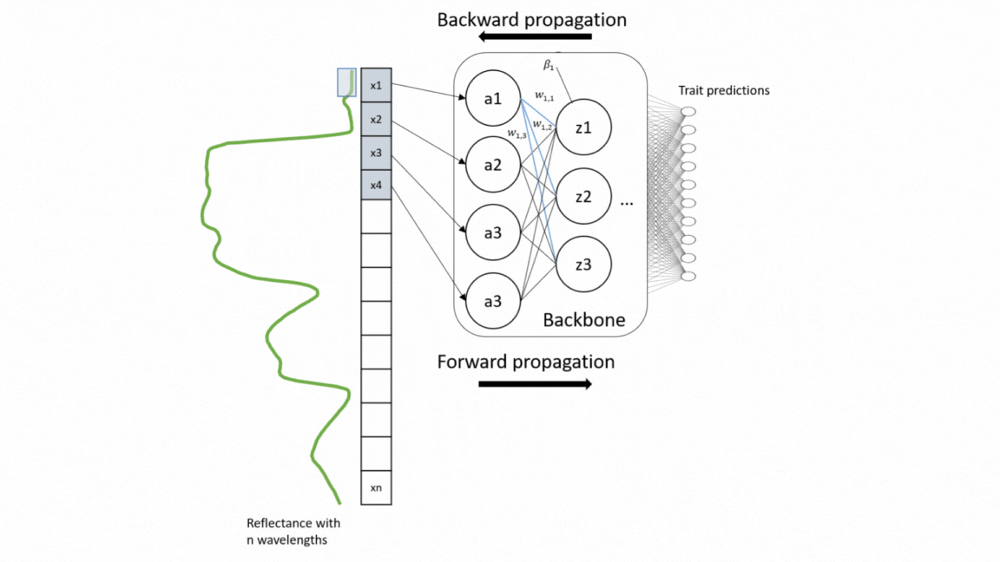
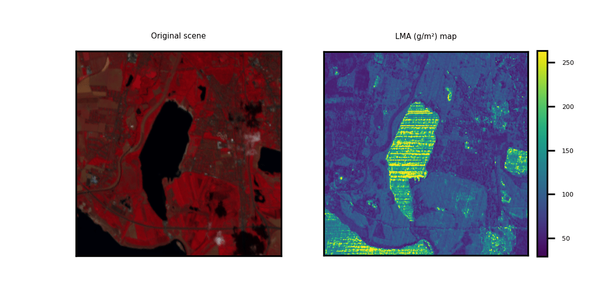

# multiTraitPredictions

## Introduction
For a wide range of applications, including vegetation modeling in Earth systems models, nature conservation, and forest monitoring, global information on functional plant traits is essential. Yet the coverage of concurrent measurement of multiple plant traits across different ecosystem types is still sparse. With the upcoming unprecedented amount of spectroscopy data, we present here a model that simultaneously retrieve 20 structural and biochemical traits from canopy reflectance data (Multi-trait model). 

## Methodology and evaluation
This repository is built upon models developed by [Cherif et al. 2023_RSE](https://www.sciencedirect.com/science/article/pii/S0034425723001311?dgcid=author)
For the model training, a large number of data sets of canopy spectra and their corresponding leaf trait measurements were compiled, including 42 data sets from different ecosystem types and sesnor types. The multi-trait model was developed on a weakly supervised learning approach and therefore trained on this heterogeneous and sparse data. The used architecture of the model was an adapted version of EfficientNetB0 based on 1D-CNN. This architecture enables to extract interrelationships from the reflectance data as well as among traits.
For validation, the model was evaluated on different data sets as external validation (transferability) and compared with the widely-used Partial Least Square Regression (PLSR) models as well as single CNN models.
For in-depth technical insights into the model development process, please refer to the following repository: [code_multi](https://gitlab.com/eya95/multi-traitretrieval/).

## Multi-trait Predctions
This repository showcases practical applications through hands-on examples for generating multi-trait maps from Hyperspectral Imagery (HSI). 
While two HSI examples are provided for testing purposes, users have the flexibility to upload new scenes along with relevant information about the available bands.

For a smoother execution of the code, we have also made available this Colab notebook 

## Setup
This project is based on tensorflow v2.7.0 and python v3.9.5.
### Dependencies
1. Clone this repository
2. `conda create -n <environment-name> python==3.9`
3. `conda activate <environment-name>`
4. Install tensorflow (this model was tested for =2.7.0). May vary with your system. 
5. `cd` into the cloned repo
5. `pip install -r requirements.txt`

## How to contribute
Please contact me if you find any bugs or have problems getting the models running: https://rsc4earth.de/authors/echerif/

## Resources
* The Python-Scripts and notebooks for model devlopment can be found in [code_multi](https://gitlab.com/eya95/multi-traitretrieval/).
* The updated model object can found in models directory. As we are constantly improving the model with new data, please make sure to get the last version.
* EGU23 contribution [Session BG9.4](https://meetingorganizer.copernicus.org/EGU23/EGU23-10901.html)
